<p align="center">
  
</p>

<h1 align="center">Kiro Manager Lite</h1>

<p align="center">
  <strong>Kiro 多账号与 API Key 管理器轻量版</strong>
</p>

<p align="center">
  多账号一键切换 · API Key 管理与本地网关 · 真实调用统计 · 自动刷新与测活 · 常用工具 · 托盘常驻
</p>

<p align="center">
  
  
  
  
  
  
</p>

---

## ✨ 功能特性

### 🔐 多账号管理

- 支持搜索、状态 / 订阅 / 登录方式筛选、排序、多选和批量操作，大量账号下使用虚拟列表保持流畅
- 账号详情展示订阅档位、积分构成、超额费率、Token 有效期和完整凭证，支持隐私打码与一键复制
- Google / GitHub、AWS Builder ID、Enterprise IAM Identity Center SSO、OIDC 凭证和本地 Kiro 凭证等多种添加方式
- 一键切换 Kiro IDE 当前账号，支持批量刷新 Token / 用量、自动刷新、主动续期与切号后重启 IDE
- 真实流式对话测活，可选择模型、实时查看输出并随时中止
- 账号卡片内置 API Key 管理：直接用该账号凭证向 Kiro 控制面申请新 Key，并查看它已创建的 Key 列表（名称、前缀、创建时间）
- 新 Key 的完整明文由上游只返回一次，生成后单独弹窗展示并提供复制，未复制就关闭会二次确认；关闭后列表中仅保留前缀
- 「前往官网」一键用该账号凭证登录 Kiro 官网后台：走应用内的一次性私密会话，退出即清，不影响自己浏览器里的登录身份；页面导航全程留在应用内，地区可在系统设置的「内置浏览器」里指定（内置 50 个常用地区，也可自定义 BCP 47 标签）

### 🔑 API Key 管理

- 支持单个添加、批量导入、搜索、订阅 / 状态 / 用量 / 重置时间筛选、排序、导出和批量删除
- 每个 Key 独立绑定区域，展示订阅档位、注册邮箱、User ID、额度、重置时间和异常原因
- 支持单个与批量刷新、真实对话测活、批量测活，以及按模型消耗倍率选择测试模型
- 大量 Key 使用虚拟网格渲染；详情、历史、测活和导入导出弹窗均按需挂载，减少首屏开销

### 🌐 本地网关与调用统计

- 本地 KRS / CPS 网关可将 Kiro IDE 请求接管到指定 API Key，支持运行中即时切换 Key
- 自动探测当前 Kiro 版本是否真正支持自定义网关端点，并监视配置被 IDE 回写后的自动恢复
- 按真实请求统计请求数、成功率、RPM 和服务端权威积分消耗，辅助请求与对话请求分开计数
- 网关调用历史按分钟聚合并持久化，可查看请求数 / 成功率 / 积分曲线、明细和汇总数据
- 可选「网关错误自动续接」，按状态码、次数和固定间隔重试可恢复错误，不掩盖额度耗尽问题

### 📈 用量与历史

- 账号和 API Key 每次刷新都会记录积分变化，支持平滑趋势曲线、明细表、清空与 Excel 导出
- 历史曲线采用不过冲的单调平滑插值，时间轴末端标签完整显示
- 删除账号或 Key 时同步清理关联历史、网关统计和备份残留，避免孤儿数据继续占用存储

### 📦 导入与导出

- 账号支持卡密、精简 JSON、完整备份 JSON、CSV 和 TXT，可粘贴内容或一次选择多个文件导入
- API Key 支持批量导入与导出，账号和 Key 的大批量校验 / 刷新并发数均可配置
- 导出可保存到文件或复制到剪贴板，并可选择是否包含敏感凭证

### 🧰 常用工具

- 「自动同意 AI 操作」可配置 Kiro 的命令、文件和网络操作权限，开启前明确展示安全风险并支持原样恢复
- 「网关错误自动续接」集中配置重试状态码、次数与间隔
- 工具状态、目标配置路径和不兼容原因均在页面内可视化展示

### 🖥️ 桌面端体验

- 系统托盘常驻，可查看当前账号、刷新、切号、复制邮箱和显示窗口；关闭行为支持最小化到托盘 / 退出 / 每次询问
- macOS 中文菜单栏、自定义协议 `kiro-manager-lite://` / `kml://` 和单实例唤起
- 管理页详情、图表和各类模态框按用户操作实时挂载，页面切换不再等待退出动画，减少大数据量下的白屏感
- 关于页手动检查更新会立即显示加载态；GitHub API 失败时自动重试并通过 Releases 页面兜底，失败后可重试或手动更新

### 🧾 系统日志

- 主进程与渲染进程日志汇入同一时间线，支持关键字、时间、分类和级别筛选
- 内存环形缓冲保留最近 5 万条，磁盘分片落盘并自动清理，虚拟滚动可承载数万行
- 支持跟随最新日志、导出筛选结果、打开日志目录和一键清空；向上查看历史时不会被新日志强制拉回底部

### ⚙️ 个性化设置

- 深色模式、主题色、隐私打码、积分精度和删除确认
- Token / 用量自动刷新间隔、主动续期、批量与导入并发数
- REST / CBOR 用量接口、HTTP 代理、网关端口，以及数据、备份和日志目录快捷打开

---

## 📸 截图

### 主页

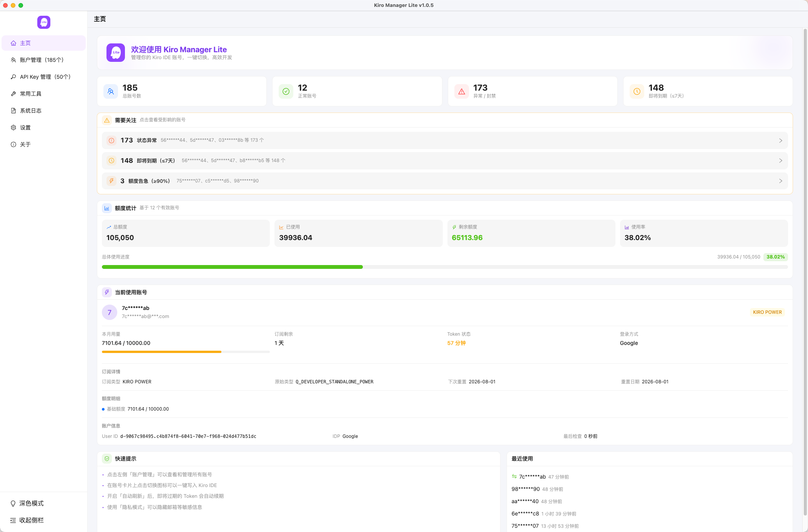

### 账户管理

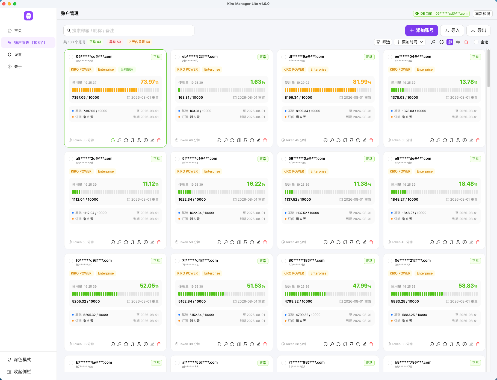

### 添加账号

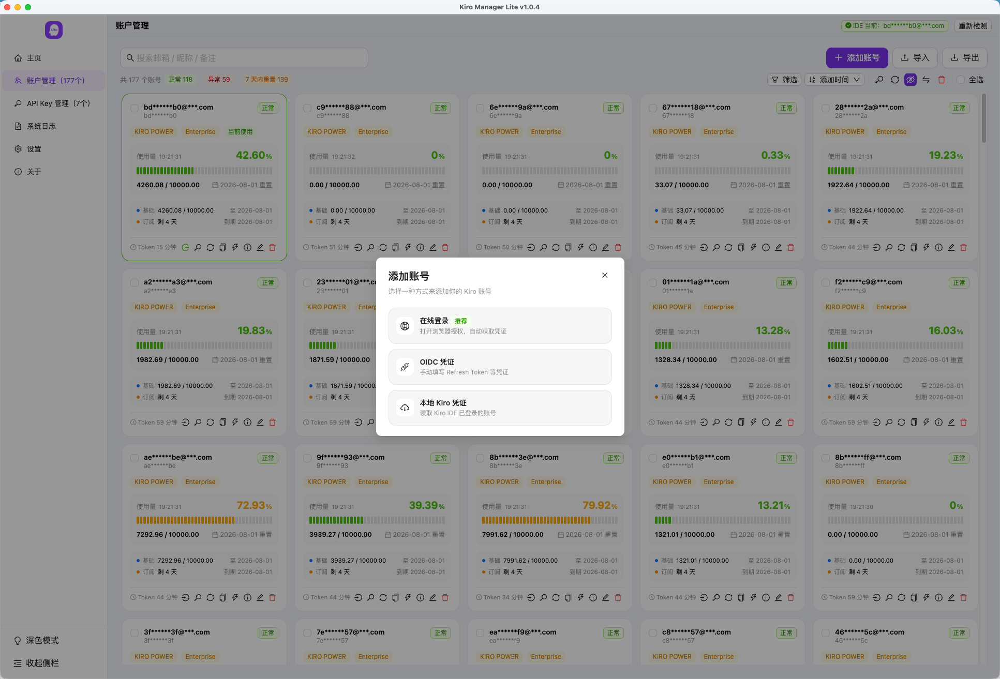

### 在线登录

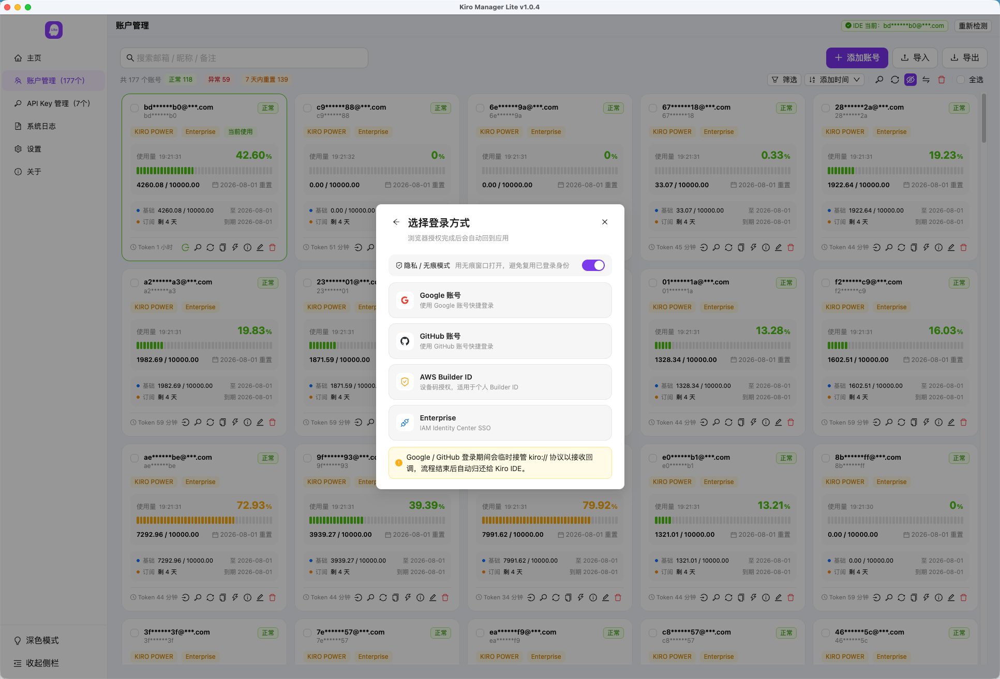

### 切换账号

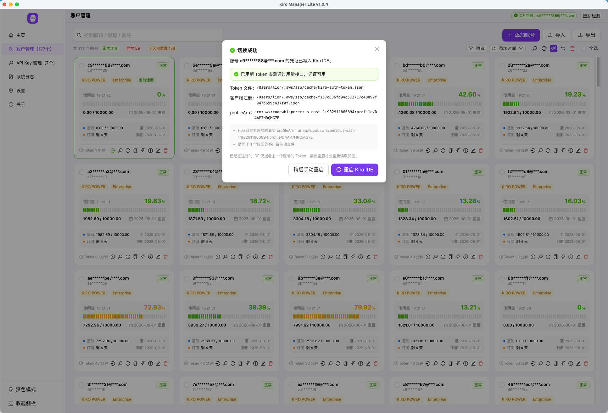

### 账号 API Key 管理

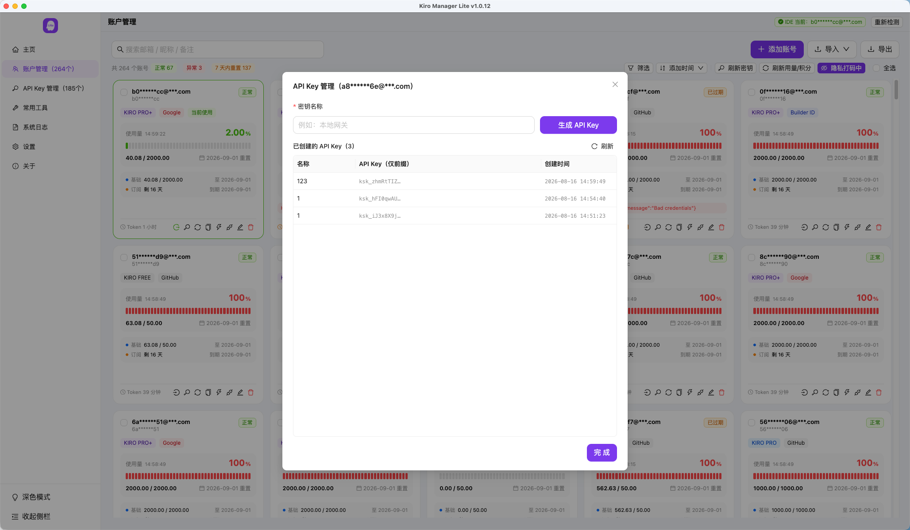

### 账号测活

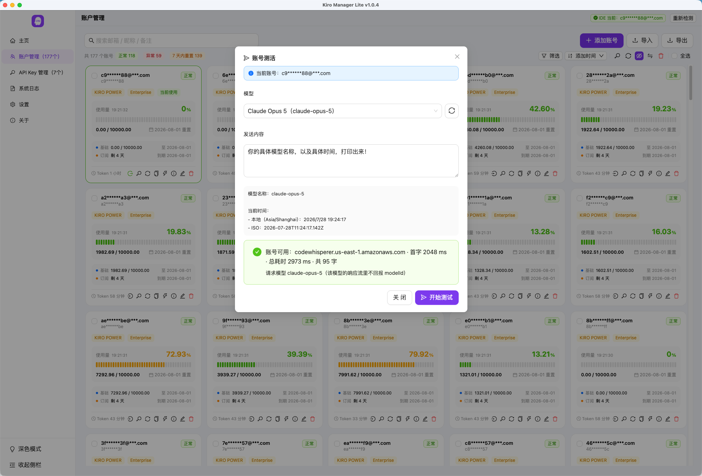

### API Key 管理

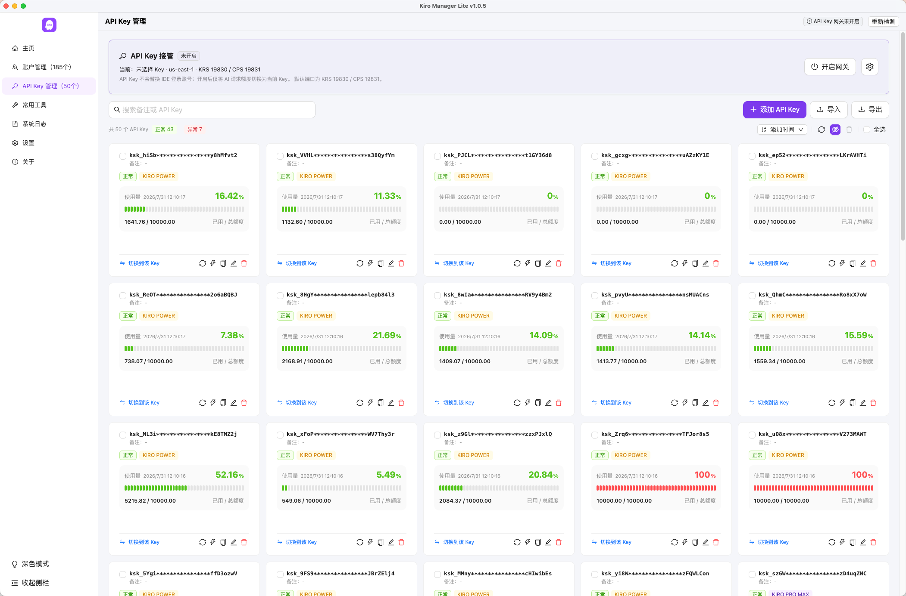

### API Key 网关

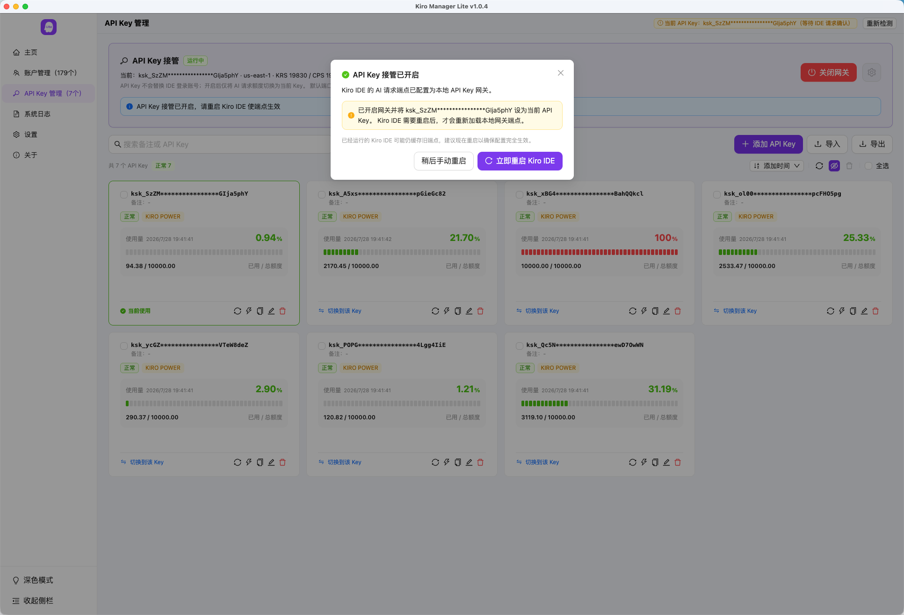

### 常用工具

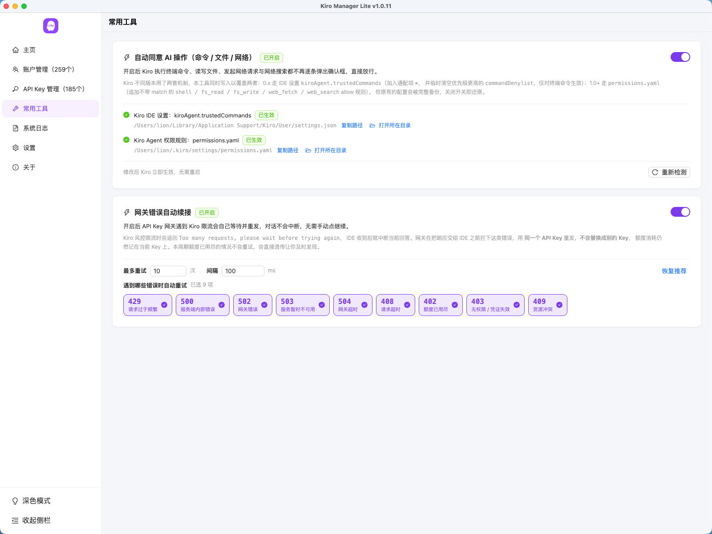

### 系统日志

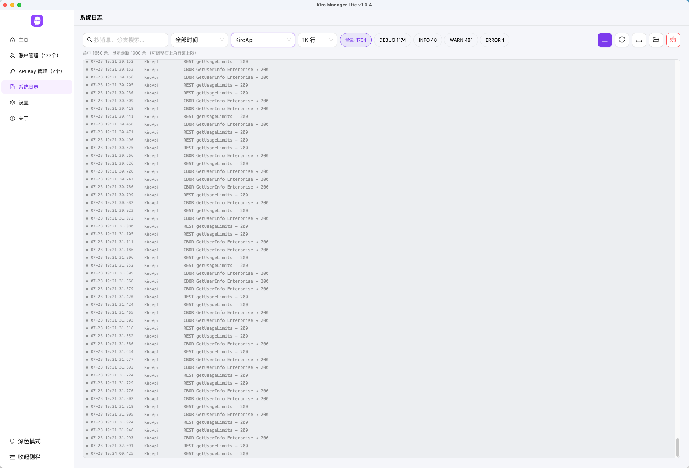

### 设置

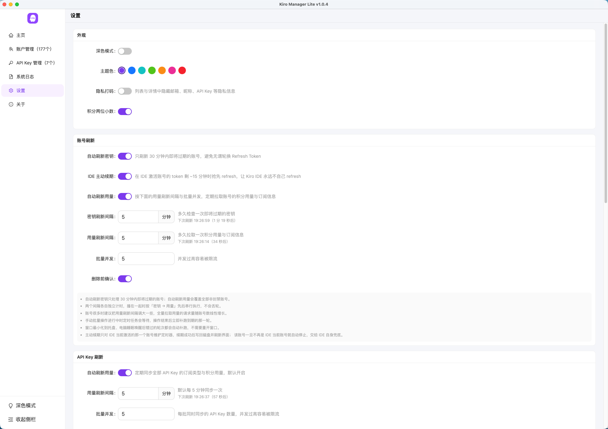

### 关于

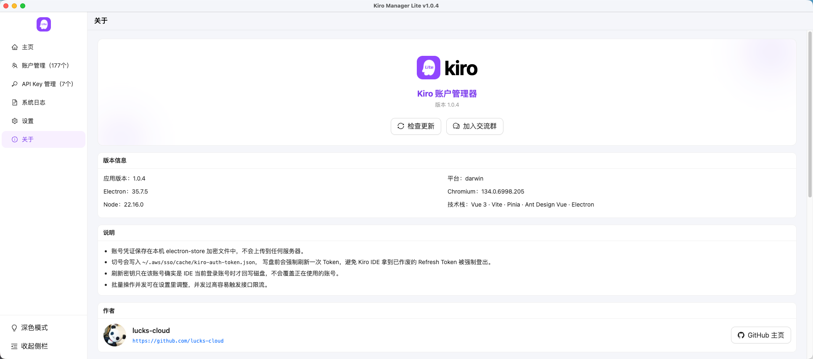

---

## 📥 安装说明

前往 [Releases](https://github.com/lucks-cloud/kiro-manager-lite/releases) 下载对应平台的安装包。
如遇到系统拦截、架构选择、升级或卸载问题，请查看 **[安装说明与常见问题](./INSTALL.md)**。

| 平台 | 文件 | 说明 |
| --- | --- | --- |
| macOS (Apple Silicon) | `*-mac-arm64.dmg` | M 系列芯片 |
| macOS (Intel) | `*-mac-x64.dmg` | Intel 芯片 |
| Windows | `*-win-x64-setup.exe` | 仅 x64 |
| Linux | `*-linux-x86_64.AppImage` | 仅 x64 |

`.zip`、`.blockmap` 与 `latest*.yml` 主要供自动更新使用，手动安装无需下载。

---

## 🛠️ 技术栈

| 层 | 选型 |
| --- | --- |
| 前端框架 | Vue 3 + TypeScript |
| 桌面框架 | Electron 35 |
| 状态管理 | Pinia |
| UI 组件 | Ant Design Vue 4 |
| 构建工具 | Vite + electron-vite |
| 网络层 | undici（统一 fetch + 代理） |
| 持久化 | electron-store（加密存储 + 滚动备份） |

---

## 🚀 开发

```bash
# 安装依赖
npm install

# 启动开发环境
npm run dev

# 类型检查
npm run typecheck

# 类型检查 + 构建产物
npm run build

# 打安装包（win / linux 同理）
npm run build:mac
```

---

## 📂 目录结构

```
src/
  shared/types.ts        主进程与渲染进程共享类型
  main/
    index.ts             应用生命周期与窗口
    appMenu.ts           macOS 中文菜单栏
    ipc.ts               IPC 注册
    accountService.ts    校验 / 刷新 / 状态检查 / 切号
    onlineLogin.ts       在线登录：设备码、社交登录、Enterprise SSO
    kiroApi.ts           Token 刷新、用量与积分接口
    kiroAuth.ts          Kiro IDE 凭证文件读写与 profileArn 决策
    kiroChat.ts          账号测活：模型列表与流式对话
    kiroProcess.ts       Kiro IDE 进程检测、打开、关闭与重启
    logger.ts            系统日志：内存环形缓冲、分片落盘、接管 console
    proactiveRenewal.ts  Token 主动续期调度
    tray.ts              系统托盘
    net.ts               统一 fetch 与代理
    store.ts             持久化与滚动备份
  preload/               contextBridge 暴露的 API
  renderer/src/
    stores/              Pinia：accounts / settings
    views/               HomeView / AccountsView / LogsView / SettingsView / AboutView
    components/          layout、accounts、common 下的组件
    utils/               格式化、导入导出解析、托盘桥接
```

---

## 🔒 安全说明

- 账号凭证保存在本机 electron-store 加密文件里，不会上传到任何第三方服务
- 渲染进程开启 contextIsolation、关闭 nodeIntegration，所有系统调用走 preload 白名单
- 导出内容包含可直接登录的凭证，请勿放到公开位置；导出时可关闭「包含凭证」
- Google / GitHub 在线登录期间会临时把 `kiro://` 协议注册到本应用（Kiro 授权服务只接受这个固定回调地址），登录结束或应用退出时立即注销，不会长期抢占 Kiro IDE 的协议
- Enterprise SSO 的回调服务器只监听 `127.0.0.1` 的随机端口，授权完成即关闭，state 与 PKCE 全程校验

---

## 🔖 更新日志

各版本变更记录见 [CHANGELOG.md](CHANGELOG.md)，当前版本 v1.0.15，最后更新于 2026-08-21。

---

## 💬 交流群

<p align="center">
  
</p>

---

## 🙏 致谢与许可

账户管理相关的接口实现参考了开源项目 [Kiro-account-manager](https://github.com/chaogei/Kiro-account-manager)（AGPL-3.0），
本项目在其基础上重写为 Vue 技术栈，并裁剪为纯账户管理，去掉了反向代理、注册机、机器码管理、MITM 代理等模块。

- 作者：[lucks-cloud](https://github.com/lucks-cloud)
- 许可：[AGPL-3.0](LICENSE)
- Kiro 官网：<https://kiro.dev>
